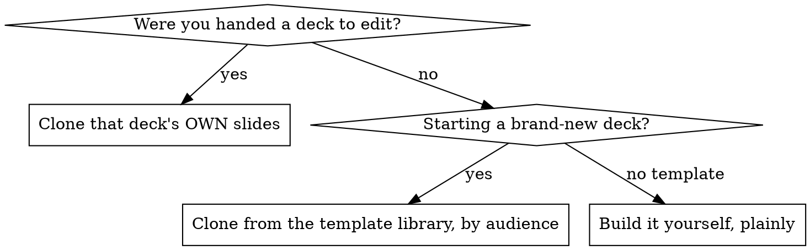

# Editing PowerPoint (.pptx)

## Overview

Edit decks with **python-pptx** (it owns the dangerous zip plumbing so the file
always reopens), get fidelity by **cloning real slides** instead of building from
blank layouts, and **render + validate after every change**. Never hand-edit the
unzipped XML and re-zip - that is what corrupts decks.

python-pptx is not a "lazy trick": it makes `[Content_Types].xml`, the `.rels`
files, unique `r:id`s, and the `p:sldIdLst` correct atomically. When you need
raw-XML fidelity (cloning a slide), do it *through* python-pptx's lxml tree, not
by editing files in a folder.

## Where the style comes from (the one real decision)



- **Handed a deck** (most common): the deck *is* the template. Clone its slides.
  No library involved.
- **Brand-new deck**: clone from a template in the library (see below), chosen by
  audience.
- Never build from a blank `slide_layout` to match a look - layouts are often
  near-empty (especially Google Slides exports), so you lose all styling.

### Template library (only for brand-new decks)

Convention (adjust the path in one place if you move it):

```
~/Documents/pptx-templates/
  work-general.pptx
  work-leadership.pptx
  work-board.pptx
  personal.pptx
```

Pick the file matching the audience, copy it to your working file, then clone its
slides. `~/Documents` is plain local storage and is NOT synced - only the Obsidian
vault at `~/Documents/obsidian/PKB/` syncs. So templates here stay on this machine;
to have them on another device, keep copies inside the vault or sync separately.

## Workflow

1. **Copy the original. Never edit it in place.** `command cp -f orig.pptx work.pptx`
   (the `cp`/`mv`/`rm` aliases prompt and silently abort under non-interactive
   tools - use `command cp`). Keep the original for diffing and rollback.
2. **Clone, don't recreate** - one clone per new slide:
   `clone_slide.py work.pptx --source N --after M`
3. **Edit the clone's text in place** with python-pptx: change existing runs,
   don't rebuild text frames (rebuilding drops the font/colour/size on the run).
4. **Render and LOOK** after every change:
   `render.sh work.pptx out --png` then Read the PNGs. This is non-negotiable;
   you cannot edit a deck blind.
5. **Validate**: `validate.py work.pptx --expect-slides K` - confirms it reopens,
   the count is right, and no relationship dangles. Catches silent corruption
   before PowerPoint does.
6. **Parallel agents**: parallelise the *content* (one agent drafts each
   activity/slide's text), but **serialise the file** - one writer applies clones
   and edits sequentially. Two processes writing one `.pptx` clobber each other.

## Quick reference

| Need | Command (run scripts in `scripts/`) |
|---|---|
| Python with python-pptx | `~/.venvs/pptx/bin/python` (1.0.2) - NOT system python |
| Render to PDF + per-slide PNG | `render.sh DECK.pptx OUTDIR --png [DPI]` |
| Duplicate a slide faithfully | `~/.venvs/pptx/bin/python clone_slide.py DECK --source N --after M [--times K]` |
| Integrity / slide-count check | `~/.venvs/pptx/bin/python validate.py DECK --expect-slides K` |

Renderer is the **LibreOffice flatpak** (`org.libreoffice.LibreOffice`), not
headless Chrome - Chrome cannot render `.pptx`. The flatpak **cannot see /tmp**;
keep inputs and outputs under `$HOME`.

## Common mistakes

| Mistake | Do instead |
|---|---|
| Hand-edit unzipped XML + re-zip | Edit through python-pptx; let it own Content_Types/rels/sldIdLst |
| `python` / system interpreter | `~/.venvs/pptx/bin/python` |
| Headless Chrome to screenshot slides | `render.sh` (LibreOffice flatpak) |
| New slide from a blank layout | `clone_slide.py` an existing styled slide |
| Rebuild a text frame to change text | Edit the existing run's `.text` in place |
| Edit the original file | Work on a `command cp` copy |
| Render/output under /tmp | Use `$HOME` (flatpak sandbox can't see /tmp) |
| Two agents writing one deck | One writer; parallelise content only |
| Claim "done" without rendering | Render + `validate.py` first, then look |
